---
## Front matter
title: "Отчёт по лабораторной работе 5"
subtitle: "Конфигурирование VLAN"
author: "Абдуллахи Бахара"

## Generic otions
lang: ru-RU
toc-title: "Содержание"

## Bibliography
bibliography: bib/cite.bib
csl: pandoc/csl/gost-r-7-0-5-2008-numeric.csl

## Pdf output format
toc: true # Table of contents
toc-depth: 2
lof: true # List of figures
lot: true # List of tables
fontsize: 12pt
linestretch: 1.5
papersize: a
documentclass: scrreprt
## I18n polyglossia
polyglossia-lang:
  name: russian
  options:
	- spelling=modern
	- babelshorthands=true
polyglossia-otherlangs:
  name: english
## I18n babel
babel-lang: russian
babel-otherlangs: english
## Fonts
mainfont: IBM Plex Serif
romanfont: IBM Plex Serif
sansfont: IBM Plex Sans
monofont: IBM Plex Mono
mathfont: STIX Two Math
mainfontoptions: Ligatures=Common,Ligatures=TeX,Scale=0.94
romanfontoptions: Ligatures=Common,Ligatures=TeX,Scale=0.94
sansfontoptions: Ligatures=Common,Ligatures=TeX,Scale=MatchLowercase,Scale=0.94
monofontoptions: Scale=MatchLowercase,Scale=0.94,FakeStretch=0.9
mathfontoptions:
## Biblatex
biblatex: true
biblio-style: "gost-numeric"
biblatexoptions:
  - parentracker=true
  - backend=biber
  - hyperref=auto
  - language=auto
  - autolang=other*
  - citestyle=gost-numeric
## Pandoc-crossref LaTeX customization
figureTitle: "Рис."
tableTitle: "Таблица"
listingTitle: "Листинг"
lofTitle: "Список иллюстраций"
lotTitle: "Список таблиц"
lolTitle: "Листинги"
## Misc options
indent: true
header-includes:
  - \usepackage{indentfirst}
  - \usepackage{float} # keep figures where there are in the text
  - \floatplacement{figure}{H} # keep figures where there are in the text
---

# Цель работы

Получить основные навыки по настройке VLAN на коммутаторах сети.

# Выполнение лабораторной работы

1. В логической рабочей области Cisco Packet Tracer была построена сеть, включающая несколько коммутаторов Cisco 2960-24TT, персональные компьютеры и серверы.

   В топологии использованы следующие устройства:
   – коммутаторы msk-donskaya-babdullakhi-sw-1 – sw-4;
   – коммутатор msk-pavlovskaya-babdullakhi-sw-1;
   – рабочие станции PC-PT различных подразделений;
   – серверы web, file и mail.

   Коммутаторы соединены между собой магистральными линиями, а оконечные устройства подключены к портам доступа. Такая структура сети позволяет организовать разделение трафика с помощью технологии VLAN, а также централизованное управление VLAN через VTP.

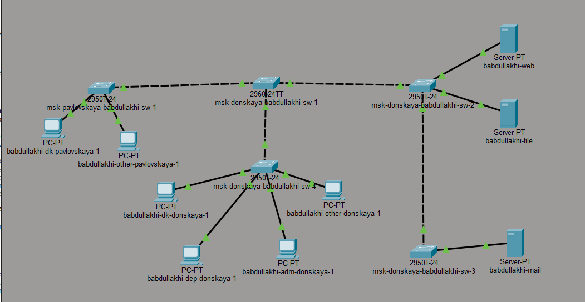{ width=70% }

2. На коммутаторе msk-donskaya-babdullakhi-sw-1 была выполнена настройка режима VTP Server.

   Для этого выполнены следующие действия:
   – переход в режим конфигурации устройства;
   – включение режима VTP server;
   – указание домена donskaya;
   – настройка пароля cisco для базы VLAN.

   После этого на коммутаторе были созданы виртуальные локальные сети (VLAN) и заданы их имена:

   – VLAN 2 — management 
   – VLAN 3 — servers 
   – VLAN 101 — dk 
   – VLAN 102 — departments 
   – VLAN 103 — adm 
   – VLAN 104 — other 

   Также были настроены Trunk-порты на интерфейсах FastEthernet0/24, GigabitEthernet0/1 и GigabitEthernet0/2 для передачи трафика всех VLAN между коммутаторами.

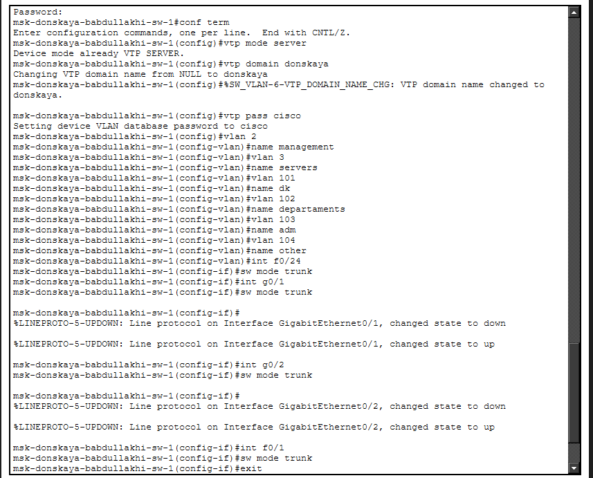{ width=70% }

   3. Далее выполнена настройка коммутатора msk-donskaya-babdullakhi-sw-2.

   Коммутатор был переведён в режим VTP Client, после чего были заданы параметры VTP:

   – домен donskaya 
   – пароль cisco 

   Затем на интерфейсах GigabitEthernet0/1 и GigabitEthernet0/2 были настроены Trunk-порты для соединения с другими коммутаторами.

   Порты FastEthernet0/1 – FastEthernet0/2 были настроены как access-порты и включены в VLAN 3, предназначенную для серверного сегмента сети.

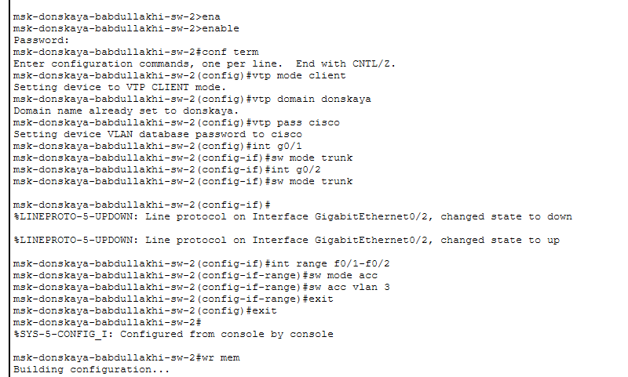{ width=70% }

  4. Аналогичная настройка была выполнена на коммутаторе msk-donskaya-babdullakhi-sw-3.

   Устройство было переведено в режим VTP Client, после чего были заданы параметры:

   – домен donskaya 
   – пароль cisco 

   Интерфейс GigabitEthernet0/1 был настроен в режиме Trunk, обеспечивающем передачу VLAN между коммутаторами.

   Порты FastEthernet0/1 – FastEthernet0/2 были переведены в режим access и назначены в VLAN 3, к которой подключены серверы сети.

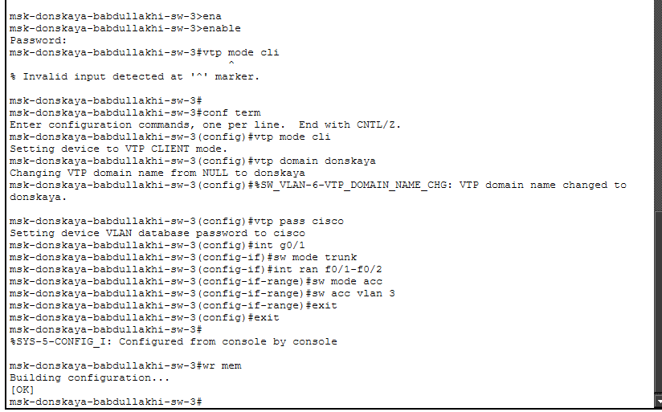{ width=70% }
  
  5. На коммутаторе msk-donskaya-babdullakhi-sw-4 была выполнена настройка VTP Client и назначение портов в соответствующие VLAN.

   После указания домена donskaya и пароля cisco был настроен магистральный порт GigabitEthernet0/1.

   Далее выполнено распределение диапазонов портов по VLAN:

   – FastEthernet0/1 – FastEthernet0/5 → VLAN 101 (сегмент DK) 
   – FastEthernet0/6 – FastEthernet0/10 → VLAN 102 (отделы) 
   – FastEthernet0/11 – FastEthernet0/15 → VLAN 103 (администрация) 
   – FastEthernet0/16 – FastEthernet0/20 → VLAN 104 (прочие устройства) 

   Такая конфигурация обеспечивает логическое разделение сети по подразделениям организации.
   
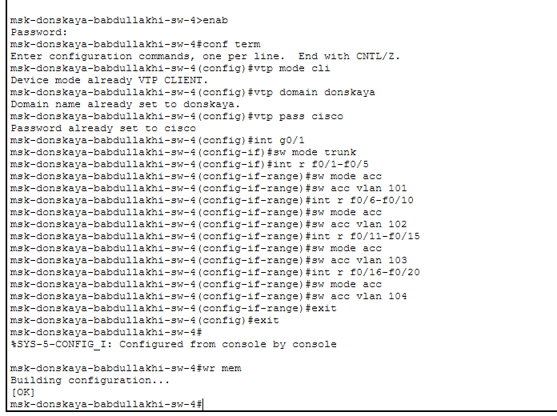{ width=70% }

6. Последним был настроен коммутатор msk-pavlovskaya-babdullakhi-sw-1, который также был переведён в режим VTP Client.

   После указания параметров домена donskaya и пароля cisco был настроен Trunk-порт FastEthernet0/24 для соединения с центральным коммутатором сети.

   Далее выполнена настройка портов доступа:

   – FastEthernet0/1 – FastEthernet0/15 → VLAN 101 
   – FastEthernet0/20 → VLAN 104 

   После завершения конфигурации настройки были сохранены в энергонезависимую память устройства.
   
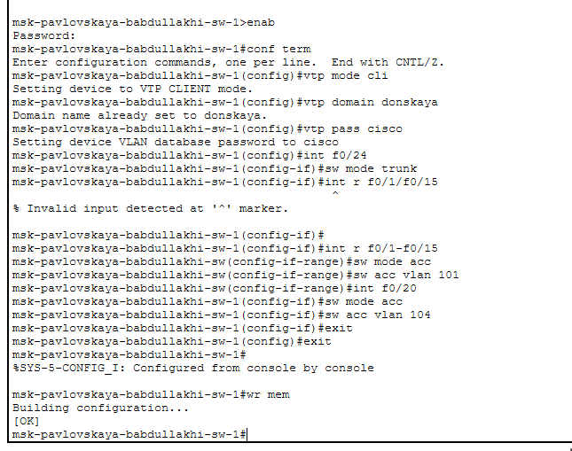{ width=70% }

7. Далее была выполнена настройка IP-адресов на серверах сети. Для каждого сервера был задан статический IP-адрес, соответствующий серверной подсети, а также указан адрес шлюза по умолчанию.

   На сервере babdullakhi-web были заданы следующие параметры сети:
   – IPv4-адрес: 10.128.0.2 
   – Маска подсети: 255.255.255.0 
   – Шлюз по умолчанию: 10.128.0.1
   
{ width=70% }

На сервере babdullakhi-file были заданы следующие параметры сети:
   – IPv4-адрес: 10.128.0.3 
   – Маска подсети: 255.255.255.0 
   – Шлюз по умолчанию: 10.128.0.1
   
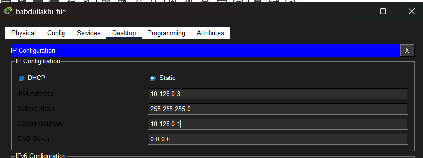{ width=70% }

На сервере babdullakhi-mail были заданы следующие параметры сети:
   – IPv4-адрес: 10.128.0.4 
   – Маска подсети: 255.255.255.0 
   – Шлюз по умолчанию: 10.128.0.1
   
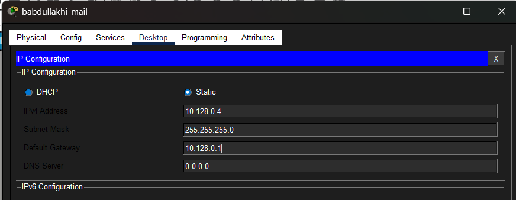{ width=70% }

8. После настройки серверов была выполнена конфигурация сетевых параметров на оконечных устройствах (рабочих станциях). На каждом компьютере были заданы статические IP-адреса в соответствии с диапазоном сети VLAN, а также указан адрес шлюза по умолчанию.

   На рабочей станции babdullakhi-dk-donskaya-1 заданы следующие параметры:
   – IPv4-адрес: 10.128.3.10 
   – Маска подсети: 255.255.255.0 
   – Шлюз по умолчанию: 10.128.3.1
   
{ width=70% }

На рабочей станции babdullakhi-dep-donskaya-1 заданы следующие параметры:
   – IPv4-адрес: 10.128.4.10 
   – Маска подсети: 255.255.255.0 
   – Шлюз по умолчанию: 10.128.4.1
 
{ width=70% }

На рабочей станции babdullakhi-adm-donskaya-1 заданы следующие параметры:
   – IPv4-адрес: 10.128.5.10 
   – Маска подсети: 255.255.255.0 
   – Шлюз по умолчанию: 10.128.5.1
   
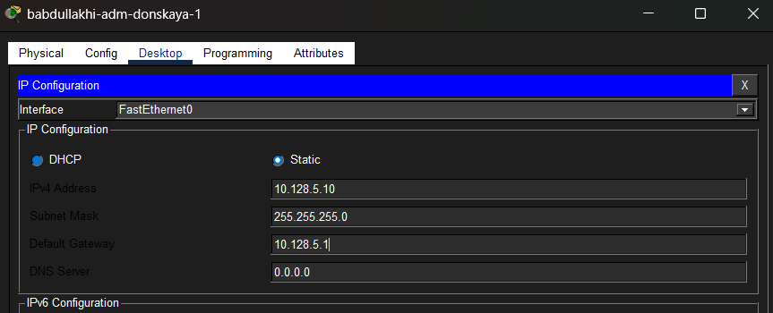{ width=70% }

На рабочей станции babdullakhi-other-donskaya-1 заданы следующие параметры:
   – IPv4-адрес: 10.128.6.10 
   – Маска подсети: 255.255.255.0 
   – Шлюз по умолчанию: 10.128.6.1
   
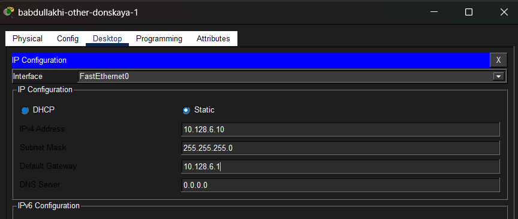{ width=70% }

На рабочей станции babdullakhi-dk-pavlovskaya-1 заданы следующие параметры:
   – IPv4-адрес: 10.128.3.20 
   – Маска подсети: 255.255.255.0 
   – Шлюз по умолчанию: 10.128.3.1
   
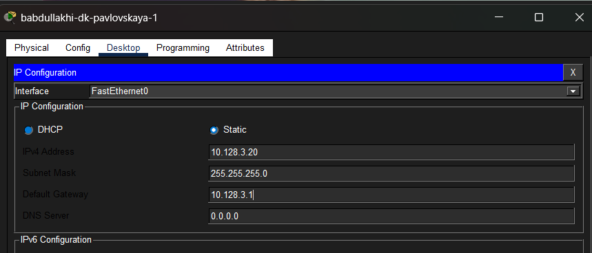{ width=70% }

На рабочей станции babdullakhi-other-pavlovskaya-1 заданы следующие параметры:
   – IPv4-адрес: 10.128.6.20 
   – Маска подсети: 255.255.255.0 
   – Шлюз по умолчанию: 10.128.6.1
   
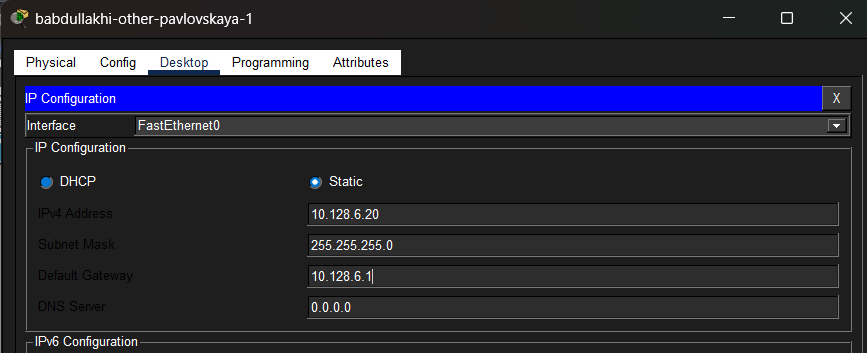{ width=70% }

9. После настройки IP-адресов на серверах и оконечных устройствах была выполнена проверка сетевой доступности с помощью команды ping. Проверка проводилась между устройствами, принадлежащими одному VLAN, а также между устройствами разных VLAN.

   С сервера babdullakhi-mail была выполнена проверка доступности web-сервера с IP-адресом 10.128.0.2. В результате были получены ответы на все отправленные пакеты, что подтверждает корректную работу сети внутри одного VLAN.

   При попытке отправить ICMP-запрос к устройству с IP-адресом 10.128.3.10 ответы получены не были. Это объясняется тем, что данные устройства находятся в разных VLAN и между ними отсутствует маршрутизация.
   
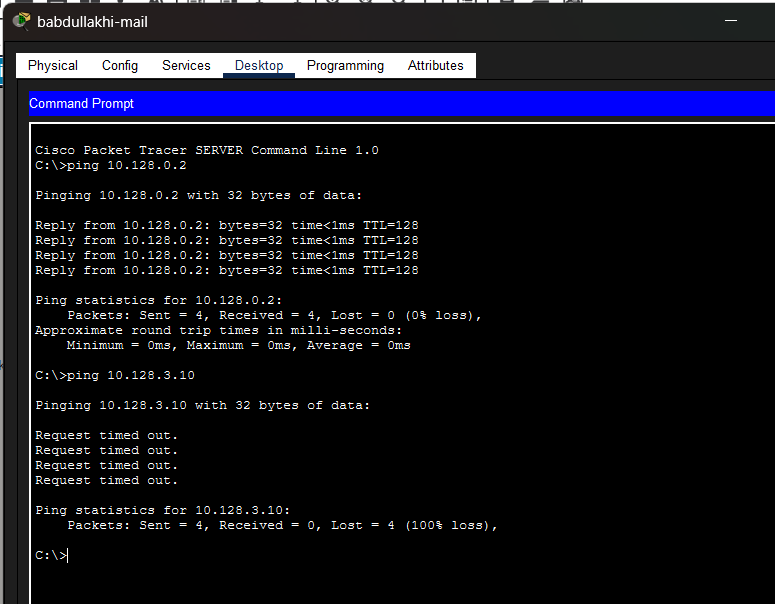{ width=70% }

10. Аналогичная проверка была выполнена с рабочей станции babdullakhi-dk-donskaya-1. При отправке команды ping на устройство babdullakhi-dk-pavlovskaya-1 с IP-адресом 10.128.3.20 были получены ответы на все пакеты. Это подтверждает корректную передачу данных между устройствами, находящимися в одной виртуальной локальной сети VLAN.

   При попытке отправить пакеты на устройство из другой VLAN (например, 10.128.4.10) соединение установлено не было, что соответствует логике сегментации сети.
   
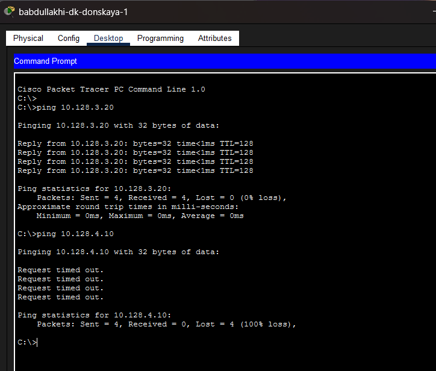{ width=70% }

11. Дополнительная проверка была выполнена с рабочей станции babdullakhi-other-donskaya-1. Пакеты успешно передаютс
я к устройству babdullakhi-other-pavlovskaya-1 с IP-адресом 10.128.6.20, так как оба устройства принадлежат VLAN 104.

   При попытке отправить ICMP-запрос к устройству VLAN 103 (10.128.5.10) ответы получены не были. Это подтверждает корректное разделение сети по VLAN.
   
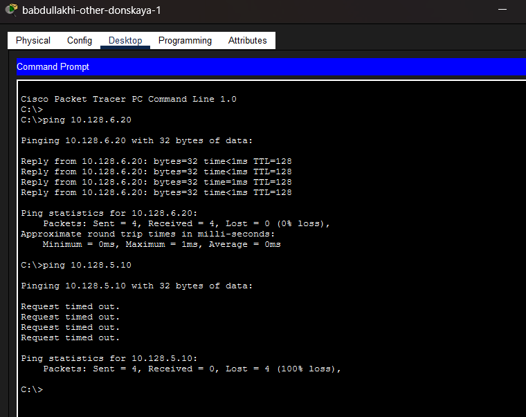{ width=70% }

12. Для анализа процесса передачи пакетов был использован режим Simulation в Cisco Packet Tracer. В данном режиме можно наблюдать пошаговое прохождение пакетов по сети и взаимодействие сетевых устройств.

   Во время отправки ICMP-запроса был отслежен путь прохождения пакета от источника к получателю через коммутаторы сети. В панели событий отображается последовательность обработки пакета сетевыми устройствами.
   
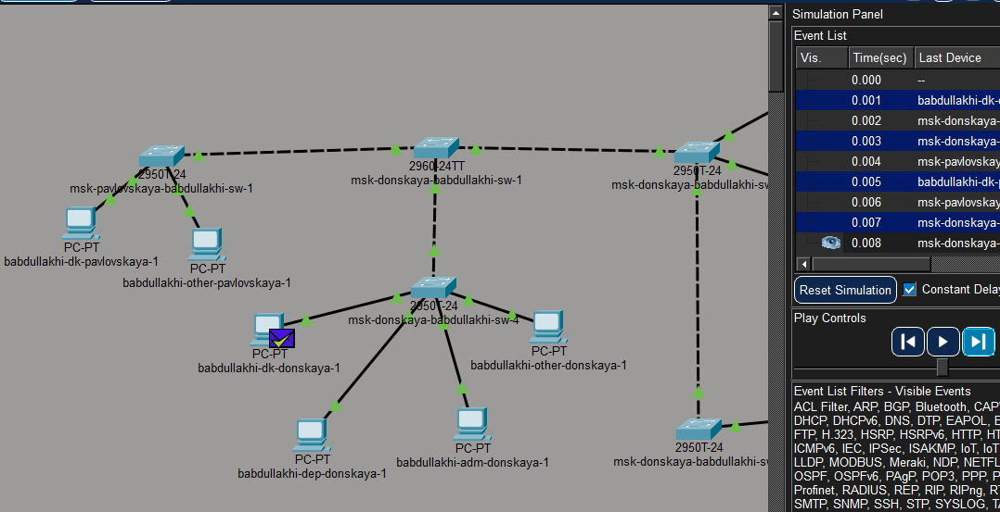{ width=70% }

13. Также была изучена структура передаваемого пакета. В окне PDU Information отображаются заголовки протоколов различных уровней модели OSI.

   В составе пакета можно увидеть:
   – заголовок Ethernet II, содержащий MAC-адреса источника и назначения; 
   – заголовок протокола IP с адресами отправителя и получателя; 
   – заголовок ICMP, используемый для передачи echo-запроса и echo-ответа.

   В частности, в рассматриваемом пакете указаны следующие параметры:
   – IP-адрес источника: 10.128.3.20 
   – IP-адрес назначения: 10.128.3.10 
   – протокол верхнего уровня: ICMP 

   Данные параметры подтверждают корректную передачу ICMP-пакета между устройствами, находящимися в одной сети VLAN.
   
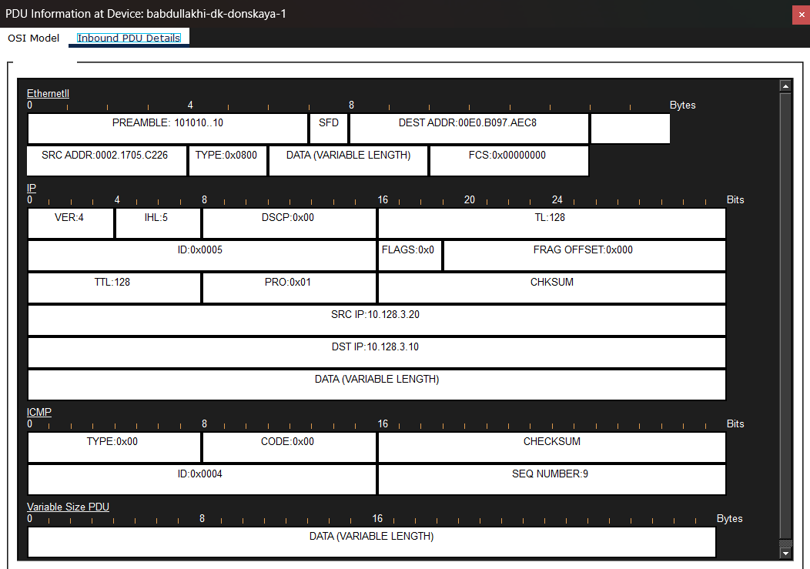{ width=70% }

# Вывод

В ходе лабораторной работы в среде Cisco Packet Tracer была построена и настроена локальная вычислительная сеть, состоящая из нескольких коммутаторов, серверов и пользовательских рабочих станций. Была создана сетевая топология, обеспечивающая соединение между различными сегментами сети.

В процессе выполнения работы на центральном коммутаторе был настроен режим VTP Server, а также созданы VLAN, предназначенные для разделения сети на логические сегменты. Остальные коммутаторы были переведены в режим VTP Client, что позволило автоматически распространить информацию о VLAN по всей сети. Также были настроены Trunk-порты для передачи трафика между коммутаторами.

Далее на серверах и оконечных устройствах были назначены статические IP-адреса в соответствии с регламентом адресации сети и указаны адреса шлюзов по умолчанию. После этого была выполнена проверка сетевой доступности с использованием команды ping. Результаты проверки показали, что устройства внутри одного VLAN успешно обмениваются данными, в то время как устройства из разных VLAN недоступны друг для друга, что подтверждает корректность сегментации сети.

Дополнительно в режиме Simulation был изучен процесс передачи ICMP-пакетов по сети и проанализирована структура передаваемого пакета, включая заголовки Ethernet, IP и ICMP. Полученные результаты подтвердили правильность выполненной конфигурации сети и корректную работу механизмов VLAN и VTP.

# Контрольные вопросы

1. Какая команда используется для просмотра списка VLAN на сетевом устройстве? 
Для просмотра списка VLAN на коммутаторе Cisco используется команда:

show vlan brief

Данная команда отображает таблицу VLAN, в которой указываются:
– номер VLAN; 
– имя VLAN; 
– статус VLAN; 
– список портов, входящих в соответствующую VLAN. 

Эта команда позволяет быстро проверить конфигурацию виртуальных локальных сетей на коммутаторе.

2. Охарактеризуйте VLAN Trunking Protocol (VTP). Приведите перечень команд с пояснениями для настройки и просмотра информации о VLAN. 
VLAN Trunking Protocol (VTP) — это протокол уровня канального уровня модели OSI, предназначенный для централизованного управления VLAN в сети, состоящей из нескольких коммутаторов. С помощью VTP информация о созданных VLAN автоматически распространяется между коммутаторами внутри одного домена.

В VTP существуют три режима работы коммутатора:
– Server — позволяет создавать, изменять и удалять VLAN; изменения распространяются на другие коммутаторы; 
– Client — получает информацию о VLAN от VTP-сервера, но не может изменять её; 
– Transparent — не участвует в синхронизации VLAN, но передаёт VTP-сообщения другим коммутаторам.

Основные команды настройки VTP:

vtp mode server 
Переводит коммутатор в режим VTP Server.

vtp mode client 
Переводит коммутатор в режим VTP Client.

vtp domain <имя_домена> 
Задаёт имя VTP-домена.

vtp password <пароль> 
Устанавливает пароль для защиты обмена информацией о VLAN.

vlan <номер> 
Создаёт новую VLAN.

name <имя> 
Задаёт имя для VLAN.

Команды просмотра информации:

show vtp status 
Отображает информацию о состоянии VTP, режиме работы и версии протокола.

show vlan brief 
Показывает список всех VLAN и порты, входящие в них.

3. Охарактеризуйте Internet Control Message Protocol (ICMP). Опишите формат пакета ICMP. 
Internet Control Message Protocol (ICMP) — это сетевой протокол, используемый для передачи служебных и диагностических сообщений в IP-сетях. Он применяется для проверки доступности устройств, диагностики сетевых проблем и уведомления о возникших ошибках.

ICMP используется такими утилитами, как:
– ping — для проверки доступности узла; 
– traceroute — для определения маршрута прохождения пакетов.

Формат ICMP-пакета включает следующие поля:
– Type (тип сообщения) — определяет тип ICMP-сообщения; 
– Code (код) — уточняет тип сообщения; 
– Checksum (контрольная сумма) — используется для проверки целостности пакета; 
– Identifier — идентификатор сообщения; 
– Sequence Number — номер последовательности; 
– Data — поле данных переменной длины.

4. Охарактеризуйте Address Resolution Protocol (ARP). Опишите формат пакета ARP. 
Address Resolution Protocol (ARP) — это протокол, предназначенный для определения MAC-адреса устройства по известному IP-адресу в локальной сети. Он используется при передаче данных внутри одной сети Ethernet.

Когда устройство хочет отправить пакет другому узлу, оно сначала проверяет ARP-таблицу. Если MAC-адрес неизвестен, отправляется широковещательный ARP-запрос. Устройство с соответствующим IP-адресом отвечает ARP-ответом, содержащим свой MAC-адрес.

Формат ARP-пакета включает следующие поля:
– Hardware Type (HTYPE) — тип канального протокола (например, Ethernet); 
– Protocol Type (PTYPE) — тип сетевого протокола (обычно IPv4); 
– Hardware Address Length (HLEN) — длина MAC-адреса; 
– Protocol Address Length (PLEN) — длина IP-адреса; 
– Operation (OPER) — тип операции (запрос или ответ); 
– Sender MAC Address — MAC-адрес отправителя; 
– Sender IP Address — IP-адрес отправителя; 
– Target MAC Address — MAC-адрес получателя; 
– Target IP Address — IP-адрес получателя.

5. Что такое MAC-адрес? Какова его структура? 
MAC-адрес (Media Access Control Address) — это уникальный аппаратный адрес сетевого интерфейса, используемый на канальном уровне модели OSI для идентификации устройств в локальной сети.

MAC-адрес имеет длину 48 бит (6 байт) и обычно записывается в шестнадцатеричном формате, например:

00:1A:2B:3C:4D:5E 
Структура MAC-адреса состоит из двух частей:
– OUI (Organizationally Unique Identifier) — первые 24 бита, идентификатор производителя оборудования; 
– NIC Specific — последние 24 бита, уникальный номер сетевого интерфейса, присваиваемый производителем.

Таким образом, MAC-адрес обеспечивает уникальную идентификацию сетевых устройств в пределах локальной сети.
